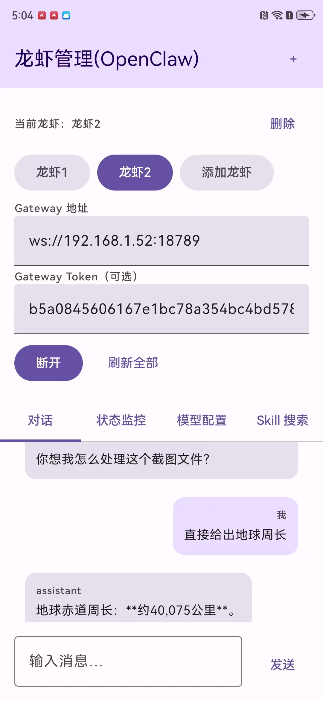

# OpenClawManager

一个用于连接与管理 **OpenClaw Gateway** 的 Android 客户端（Jetpack Compose）。

## 功能

- **WebSocket 连接 Gateway**：支持 Token（可选）
- **多龙虾配置**：可保存多个 Gateway（龙虾1/龙虾2…），在首页顶部一键切换；每只龙虾各自保持连接状态与聊天/等待状态
- **对话**：与 Gateway 的 agent 会话交互（operator 模式）
- **状态监控**：health/status/presence 等信息展示
- **模型配置**：查看/切换默认模型，保存 API Key（按 Gateway 协议写入配置）
- **Skill 搜索**：基于 Top ClawHub Skills API 搜索并复制安装命令（在运行 Gateway 的电脑终端执行）
- **合规页面**：内置《隐私政策》《用户协议》HTML，首次启动弹窗确认；支持在独立页面查看

## 环境要求

- Android Studio（建议最新稳定版）
- Android SDK：`compileSdk 34` / `minSdk 24`
- OpenClaw Gateway：推荐使用较新版本（2026.2.26+ 会有更严格的 Origin 校验）

## 快速开始（运行 App）

1. 用 Android Studio 打开项目根目录 `OpenClawManager`
2. 连接设备或启动模拟器
3. 运行 `app` 模块

## 连接局域网 Gateway（2026.2.26+ 常见坑）

新版 Gateway 可能会校验 `Origin`，报错类似：
`origin not allowed (allow it in gateway.controlUi.allowedOrigins)`

建议：

- **Gateway 侧**（示例）：

```json
{
  "gateway": {
    "port": 18789,
    "bind": "lan",
    "controlUi": {
      "allowedOrigins": [
        "http://localhost:18789",
        "http://127.0.0.1:18789",
        "http://192.168.1.33:18789"
      ]
    }
  }
}
```

- **App 侧**：本项目已在 WebSocket 连接时显式设置 `Origin`：
  - `ws://host:18789` → `Origin: http://host:18789`
  - `wss://host:port` → `Origin: https://host:port`

> 注意：`allowedOrigins` 里填的是 **http/https**（不是 ws/wss），也不建议写 `0.0.0.0`。

## 合规页面（HTML）

- `app/src/main/assets/privacy_policy.html`
- `app/src/main/assets/user_agreement.html`

首次启动会弹出隐私确认弹窗；点击条目会打开独立的 `WebViewActivity` 查看对应页面。

## 目录结构（简要）

- `app/src/main/java/com/singxie/openclawmanager/ui/`：Compose UI（`MainScreen` 等）
- `app/src/main/java/com/singxie/openclawmanager/data/`：Gateway WebSocket、Repository、远端 Skill 搜索 API
- `app/src/main/assets/`：隐私政策/用户协议 HTML

## 免责声明

本项目为管理工具示例实现。连接与调用行为受你的 Gateway 配置、网络环境以及第三方服务条款约束。

